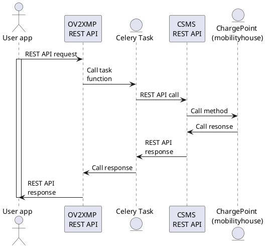
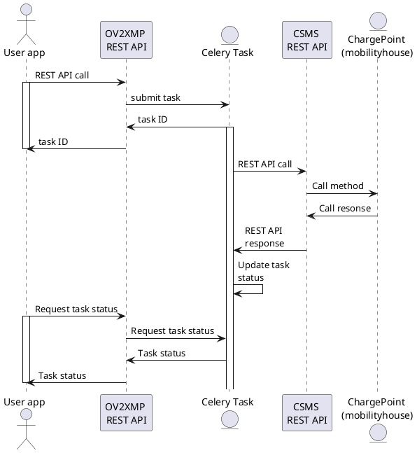

# Open Vehicle-To-Grid Management Platform (O-V2X-MP)

## Deploy O-V2X-MP from source code

1. Clone the project

    ```shell
    git clone https://gitlab.trsc-ppc.gr/ev4eu/o-v2x-mp
    ```

2. Create a Python virtual environment

    ```sh
    cd o-v2x-mp
    python3 -m venv venv
    ```

3. Activate the environment and install the requirements. Install also the prerequisites needed to build the `python-ldap` library.

    ```sh
    $ apt install gcc libldap2-dev libsasl2-dev ldap-utils python3-dev
    $ source ./venv/bin/activate
    (venv) $ pip install -r requirements.txt
    ```

4. Go to the `ov2xmp` folder

    ```sh
    cd ov2xmp
    ```

5. Migrate

    ```sh
    (venv) $ python manage.py migrate
    ```

6. Create a superuser

    ```sh
    (venv) $ python manage.py createsuperuser
    ```

7. Open a new tmux session

    ```sh
    (venv) $ tmux
    ```

8. Inside the tmux session, activate the environment, and run the Django ASGI (daphne) dev server

    ```sh
    $ source ../venv/bin/activate
    (venv) $ python manage.py runserver 0.0.0.0:8000
    ```

    Detach from the tmux session, by pressing `CTRL + B` and `D`.

9. Open a new tmux session by issuing the `tmux` command. Inside the new tmux session, activate the environment, and start the Sanic webserver

    ```sh
    $ source ../venv/bin/activate
    (venv) $ sanic csms:app --host=0.0.0.0 --port=9000 --reload
    ```

    Alternatively, if you need to record the CSMS logs to a file, issue the following instead:

    ```sh
    (venv) $ sanic csms:app --host=0.0.0.0 --port=9000 --reload 2>&1 | tee ../logs/central_system_output-3.log
    ```

    Detach from the tmux session, by pressing `CTRL + B` and `D`.

10. Open a new tmux session by issuing the `tmux` command, and start the Celery worker:

    ```sh
    $ source ../venv/bin/activate
    (venv) $ cd ov2xmp
    (venv) $ celery -A ov2xmp worker -l info
    ```

    Detach from the tmux session, by pressing `CTRL + B` and `D`.

11. Open a new tmux session by issuing the `tmux` command, and start the Celery Flower module:

    ```sh
    $ source ../venv/bin/activate
    (venv) $ celery -A ov2xmp flower
    ```

## O-V2X-MP REST API

To access the Swagger page of the O-V2X-MP REST API, visit the following page:

`http://ov2xmp.trsc.net:8000/api`

## O-V2X-MP Django Admin page

The django admin page allows you to view and modify all the django objects of O-V2X-MP (e.g., chargepoints, idTags, charging profiles, tasks, etc). To access that page, visit the following link:

`http://ov2xmp.trsc.net:8000/admin`

## Overview of task management pipeline for OCPP requests

In summary, in order for someone to initiate a synchronous request to the O-V2X-MP for an underlying EVCS (i.e., if `sync` is set to `true`):



In case of an asynchronous request (i.e., if `sync` is set to the default value (`false`):



## How to develop REST API endpoints for OCPP commands

To implement a REST API endpoint for issuing an OCPP 1.6 or 2.0.1 command that is initiated by the CSMS (e.g., a Reset command), follow the steps bellow:

1. First, we have to extend the ChargePoint class of the `ocpp` library, in order to define the entire logic of the new OCPP command. So, in `ov2xmp/chargepoint/ChargePoint16.py` or `ov2xmp/chargepoint/ChargePoint201.py`, under the "ACTIONS INITIATED BY THE CSMS" comment header, create a function for the overloaded ChargePoint class, like this:

    ```python
    # Reset
    async def reset(self, reset_type):
        request = call.ResetPayload(type = reset_type)
        response = await self.call(request)
        if response is not None:
            return {"status": response.status}
        else:
            return {"status": None}
    ```

    Some notes:

    - Start with a comment that refers to the OCPP command name
    - The function must be async.
    - The function parameters can be determined by checking the corresponding class inside `ocpp.v16.call`. For the Reset command, the parameters are derived from the `ResetPayload` class. This class has the `type` attribute, therefore we define the corresponding argument.
    - Inside the function, we define the entire logic of the OCPP command and make all the Django ORM calls. Note that in the end we must return a specific dictionary: `{"status": XXX}`, where `XXX` is whatever output we need to return.

2. Next, we have to add a REST API endpoint to the Sanic server of the CSMS (this is utilised by Django to initiate actions towards the OCPP server and the ChargePoint objects). In particular, under the CSMS REST API comment section of the `ov2xmp/csms.py` file, create a new function, like this:

    ```python
    # Reset (hard or soft)
    @app.route("/ocpp16/reset/<chargepoint_id:str>", methods=["POST"])
    async def reset(request: Request, chargepoint_id: str):
        if chargepoint_id in app.ctx.CHARGEPOINTS_V16 and request.json is not None:
            resetType = request.json["reset_type"]
            result = await app.ctx.CHARGEPOINTS_V16[chargepoint_id].reset(resetType)
            return json(result)
        else:
            return json({"status": "Charge Point does not exist"})
    ```

    Some notes:
    - Start with a comment that refers to the OCPP command name
    - The `@app.route()` decorator defines the URL of the new OCPP command. It must follow the following format: `/ocpp16/XXX/<chargepoint_id>` (replace `ocpp16` with `ocpp201` if writing an endpoint for 2.0.1), where `XXX` is the name of the OCPP command. Always the method is POST and all parameters are provided in the JSON payload, except the `chargepoint_id`, which is always defined in the URL.
    - At the beginning, the check `if chargepoint_id in app.ctx.CHARGEPOINTS_V16 and request.json is not None` is always performed. If successful, the parameters are extracted from `request.json` and the corresponding function that we implemented in step 1 is awaited.

3. Next, create a celery task that calls the REST API endpoint previously defined. To do that, define a function inside `api/tasks.py` like this:

    ```python
    @shared_task()
    def ocpp16_reset_task(chargepoint_id, reset_type):
        message = requests.post("http://localhost:9000/ocpp16/reset/" + chargepoint_id, json={"reset_type": reset_type}).json()
        send_task_update(message)
        return message
    ```

    Some notes:
    - It always start with the `@shared_task()` decorator.
    - Note the function name. It always starts with `ocpp16_` or `ocpp201_`, then the OCPP command name follows, and it ends with `_task`.
    - All command parameters are provided in the function arguments (e.g., `reset_type`)
    - Command parameters are transfered to the CSMS service via the `json` argument of the `requests.post()` function.
    - At the end, the command respond is provided to the `send_task_update()`, which broadcasts the results via Django Channels.

    > Please note that after changing `tasks.py`, you need to restart the celery worker in order for the changes to take effect.

4. Next, we can start by defining the external REST API endpoint exposed by the Django system (OpenAPI). To do this, start by defining the serializer in `api/serializers.py`. In this file, create a serializer for the endpoint, like the following:

    ```python
    class OcppResetSerializer(OcppCommandSerializer):
        reset_type = serializers.ChoiceField(choices=tuple(member.value for member in ocppv16_enums.ResetType))
    ```

    Some notes:
    - Note the class name. It starts with `Ocpp`, then the OCPP commmand follows, and it ends with `Serializer`.
    - It inherits the `OcppCommandSerializer`, which defines the parameters that are accepted by all OCPP commands. In particular, all OCPP commands must accept the `chargepoint_id` and the `sync` parameter.
    - The new serializer needs to define only the extra parameters that are associated with the corresponding OCPP command.

5. Next, define the API View inside `api/views.py` like the following:

    ```python
    class OcppResetApiView(GenericAPIView):
        permission_classes = [permissions.IsAuthenticated]
        serializer_class = OcppResetSerializer
        schema = AutoSchema(tags=['OCPP'])

        def post(self, request, *args, **kwargs):
            '''
            Send a Reset command (hard or soft)
            '''

            serializer = OcppResetSerializer(data=request.data)
            if serializer.is_valid():
                if serializer.data["sync"]:
                    task = ocpp_reset_task(serializer.data["chargepoint_id"], serializer.data["reset_type"])
                    task["success"] = True
                    return Response(task, status=status.HTTP_200_OK)
                else:
                    task = ocpp_reset_task.delay(serializer.data["chargepoint_id"], serializer.data["reset_type"]) # type: ignore
                    return Response({"success": True, "status": "Task has been submitted successfully", "task_id": task.id}, status=status.HTTP_200_OK)
            else:
                return Response(serializer.errors, status=status.HTTP_400_BAD_REQUEST)
    ```

    Some notes:
    - Keep the above structure/logic
    - Replace the serializer `serializer_class`
    - Its important to provide a command description in the comment under the `post()` function (this comment is parsed in order to automatically generate the OpenAPI spec).
    - In `serializer = OcppResetSerializer(data=request.data)` replace the serializer with your's
    - Inside the `if serializer.data["sync"]:` statement, replace the task function and its corresponding parameters.

6. Include the new endpoint in `api/urls.py`, like so:

    ```python
    path('ocpp16/reset/', OcppResetApiView.as_view()),
    ```

    Some notes:
    - In `ocpp/reset/`, replace `reset` with the command name
    - Replace `OcppResetApiView` with the name of the API view class defined previously.
