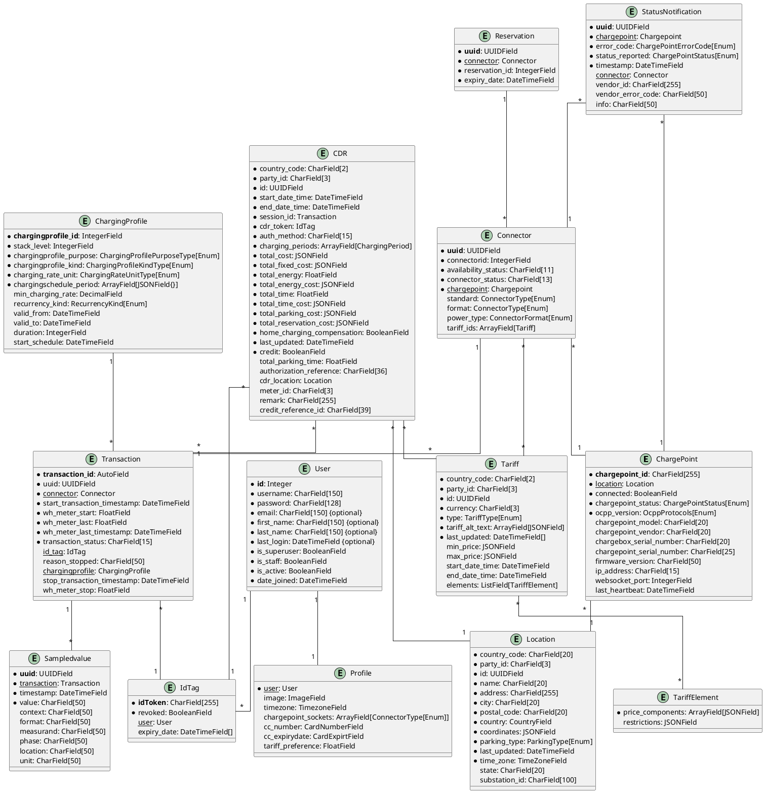

# Class Diagram

```plantuml
@startuml
' hide the spot
' hide circle

' avoid problems with angled crows feet
skinparam linetype ortho

entity "ChargePoint" as chargepoint {
    * **chargepoint_id**: CharField[255]
    * <u>location</u>: Location
    * connected: BooleanField
    * chargepoint_status: ChargePointStatus[Enum]
    * ocpp_version: OcppProtocols[Enum]
    chargepoint_model: CharField[20] 
    chargepoint_vendor: CharField[20] 
    chargebox_serial_number: CharField[20] 
    chargepoint_serial_number: CharField[25] 
    firmware_version: CharField[50] 
    ip_address: CharField[15]
    websocket_port: IntegerField
    last_heartbeat: DateTimeField
}

entity "ChargingProfile" as chargingprofile {
    * **chargingprofile_id**: IntegerField
    * stack_level: IntegerField
    * chargingprofile_purpose: ChargingProfilePurposeType[Enum]
    * chargingprofile_kind: ChargingProfileKindType[Enum]
    * charging_rate_unit: ChargingRateUnitType[Enum]
    * chargingschedule_period: ArrayField[JSONField{}]
    min_charging_rate: DecimalField 
    recurrency_kind: RecurrencyKind[Enum] 
    valid_from: DateTimeField 
    valid_to: DateTimeField 
    duration: IntegerField 
    start_schedule: DateTimeField 
}

entity "Connector" as connector {
    * **uuid**: UUIDField
    * connectorid: IntegerField
    * availability_status: CharField[11]
    * connector_status: CharField[13]
    * <u>chargepoint</u>: Chargepoint
    standard: ConnectorType[Enum]
    format: ConnectorType[Enum]
    power_type: ConnectorFormat[Enum]
    tariff_ids: ArrayField[Tariff]
}

entity "IdTag" as idtag {
    * **idToken**: CharField[255]
    * revoked: BooleanField
    <u>user</u>: User
    expiry_date: DateTimeField[] 
}

entity "Reservation" as reservation {
    * **uuid**: UUIDField
    * <u>connector</u>: Connector
    * reservation_id: IntegerField
    * expiry_date: DateTimeField
}

entity "StatusNotification" as statusnotification {
    * **uuid**: UUIDField
    * <u>chargepoint</u>: Chargepoint
    * error_code: ChargePointErrorCode[Enum]
    * status_reported: ChargePointStatus[Enum]
    * timestamp: DateTimeField 
    <u>connector</u>: Connector
    vendor_id: CharField[255] 
    vendor_error_code: CharField[50]
    info: CharField[50] 
}

entity "Transaction" as transaction {
    * **transaction_id**: AutoField
    * uuid: UUIDField
    * <u>connector</u>: Connector
    * start_transaction_timestamp: DateTimeField
    * wh_meter_start: FloatField
    * wh_meter_last: FloatField
    * wh_meter_last_timestamp: DateTimeField
    * transaction_status: CharField[15]
    <u>id_tag</u>: IdTag
    reason_stopped: CharField[50] 
    <u>chargingprofile</u>: ChargingProfile
    stop_transaction_timestamp: DateTimeField 
    wh_meter_stop: FloatField 
}

entity "User" as user {
    * **id**: Integer
    * username: CharField[150]
    * password: CharField[128]
    * email: CharField[150] {optional}
    * first_name: CharField[150] {optional}
    * last_name: CharField[150] {optional}
    * last_login: DateTimeField {optional}
    * is_superuser: BooleanField
    * is_staff: BooleanField
    * is_active: BooleanField
    * date_joined: DateTimeField
}

entity "Profile" as profile {
    * <u>user</u>: User
    image: ImageField 
    timezone: TimezoneField 
    chargepoint_sockets: ArrayField[ConnectorType[Enum]] 
    cc_number: CardNumberField 
    cc_expirydate: CardExpirtField 
    tariff_preference: FloatField 
}

entity "Location" as location {
    * country_code: CharField[20]
    * party_id: CharField[3]
    * id: UUIDField
    * name: CharField[20]
    * address: CharField[255]
    * city: CharField[20]
    * postal_code: CharField[20]
    * country: CountryField
    * coordinates: JSONField
    * parking_type: ParkingType[Enum]
    * last_updated: DateTimeField
    * time_zone: TimeZoneField
    state: CharField[20]
    substation_id: CharField[100]
}

entity "Sampledvalue" as sampledvalue {
    * **uuid**: UUIDField
    * <u>transaction</u>: Transaction
    * timestamp: DateTimeField
    * value: CharField[50]
    context: CharField[50] 
    format: CharField[50] 
    measurand: CharField[50] 
    phase: CharField[50] 
    location: CharField[50] 
    unit: CharField[50] 
}

entity "TariffElement" as tariffelement {
    * price_components: ArrayField[JSONField]
    restrictions: JSONField 
}

entity "Tariff" as tariff {
    * country_code: CharField[2]
    * party_id: CharField[3]
    * id: UUIDField
    * currency: CharField[3]
    * type: TariffType[Enum]
    * tariff_alt_text: ArrayField[JSONField]
    * last_updated: DateTimeField[]
    min_price: JSONField
    max_price: JSONField
    start_date_time: DateTimeField
    end_date_time: DateTimeField
    elements: ListField[TariffElement]
}


entity "CDR" as cdr {
    * country_code: CharField[2]
    * party_id: CharField[3]
    * id: UUIDField
    * start_date_time: DateTimeField
    * end_date_time: DateTimeField
    * session_id: Transaction
    * cdr_token: IdTag
    * auth_method: CharField[15]
    * charging_periods: ArrayField[ChargingPeriod]
    * total_cost: JSONField
    * total_fixed_cost: JSONField
    * total_energy: FloatField
    * total_energy_cost: JSONField
    * total_time: FloatField
    * total_time_cost: JSONField
    * total_parking_cost: JSONField
    * total_reservation_cost: JSONField
    * home_charging_compensation: BooleanField
    * last_updated: DateTimeField
    * credit: BooleanField
    total_parking_time: FloatField
    authorization_reference: CharField[36]
    cdr_location: Location
    meter_id: CharField[3]
    remark: CharField[255]
    credit_reference_id: CharField[39]
}

chargepoint "*" -- "1" location
connector "*" -- "1" chargepoint
connector "1" -- "*" transaction

user "1" -- "*" idtag
user "1" -- "1" profile

transaction "*" -- "1" idtag
chargingprofile "1" -- "*" transaction

transaction "1" -- "*" sampledvalue
statusnotification "*" -- "1" connector
statusnotification "*" -- "1" chargepoint
reservation "1" -- "*" connector

connector "*" -- "*" tariff

tariff "*" -- "*" tariffelement

cdr "*" -- "1" idtag
cdr "*" -- "1" transaction
cdr "*" -- "1" location
cdr "*" -- "*" tariff

@enduml
```
