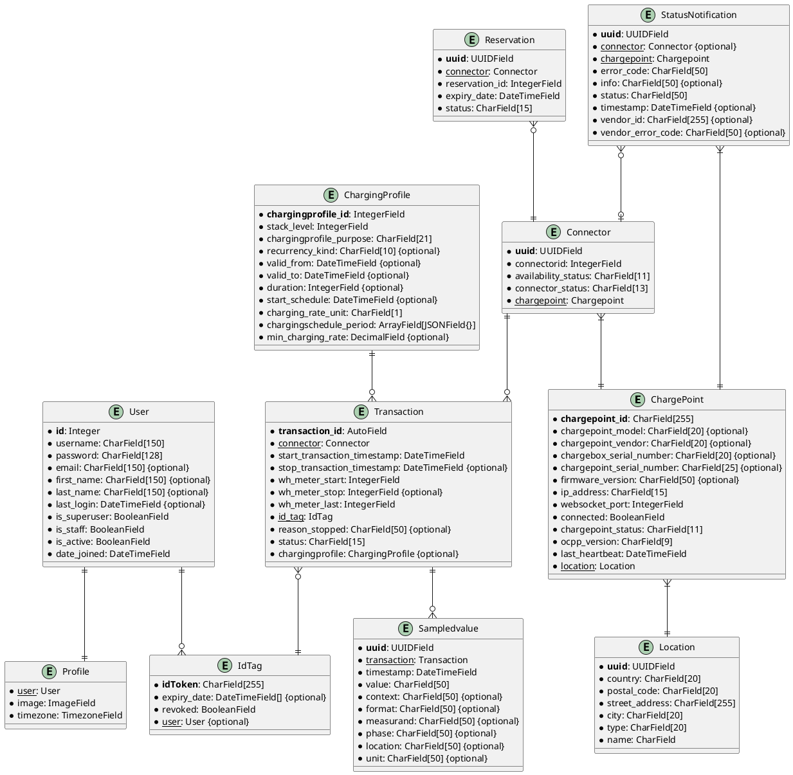

# ER Diagram

```plantuml
@startuml
' hide the spot
' hide circle

' avoid problems with angled crows feet
skinparam linetype ortho

entity "ChargePoint" as chargepoint {
    * **chargepoint_id**: CharField[255]
    * chargepoint_model: CharField[20] {optional}
    * chargepoint_vendor: CharField[20] {optional}
    * chargebox_serial_number: CharField[20] {optional}
    * chargepoint_serial_number: CharField[25] {optional}
    * firmware_version: CharField[50] {optional}
    * ip_address: CharField[15]
    * websocket_port: IntegerField
    * connected: BooleanField
    * chargepoint_status: CharField[11]
    * ocpp_version: CharField[9]
    * last_heartbeat: DateTimeField
    * <u>location</u>: Location
/'    ---
    - tarrif: CharField[255]
    - XXX'/ 
}

entity "ChargingProfile" as chargingprofile {
    * **chargingprofile_id**: IntegerField
    * stack_level: IntegerField
    * chargingprofile_purpose: CharField[21]
    * recurrency_kind: CharField[10] {optional}
    * valid_from: DateTimeField {optional}
    * valid_to: DateTimeField {optional}
    * duration: IntegerField {optional}
    * start_schedule: DateTimeField {optional}
    * charging_rate_unit: CharField[1]
    * chargingschedule_period: ArrayField[JSONField{}]
    * min_charging_rate: DecimalField {optional}
}

entity "Connector" as connector {
    * **uuid**: UUIDField
    * connectorid: IntegerField
    * availability_status: CharField[11]
    * connector_status: CharField[13]
    * <u>chargepoint</u>: Chargepoint
}

entity "IdTag" as idtag {
    * **idToken**: CharField[255]
    * expiry_date: DateTimeField[] {optional}
    * revoked: BooleanField
    * <u>user</u>: User {optional}
}

entity "Reservation" as reservation {
    * **uuid**: UUIDField
    * <u>connector</u>: Connector
    * reservation_id: IntegerField
    * expiry_date: DateTimeField
    * status: CharField[15]
}

entity "StatusNotification" as statusnotification {
    * **uuid**: UUIDField
    * <u>connector</u>: Connector {optional}
    * <u>chargepoint</u>: Chargepoint
    * error_code: CharField[50]
    * info: CharField[50] {optional}
    * status: CharField[50]
    * timestamp: DateTimeField {optional}
    * vendor_id: CharField[255] {optional}
    * vendor_error_code: CharField[50] {optional}
}

entity "Transaction" as transaction {
    * **transaction_id**: AutoField
    * <u>connector</u>: Connector
    * start_transaction_timestamp: DateTimeField
    * stop_transaction_timestamp: DateTimeField {optional}
    * wh_meter_start: IntegerField
    * wh_meter_stop: IntegerField {optional}
    * wh_meter_last: IntegerField
    * <u>id_tag</u>: IdTag
    * reason_stopped: CharField[50] {optional}
    * status: CharField[15]
    * chargingprofile: ChargingProfile {optional}
}

entity "User" as user {
    * **id**: Integer
    * username: CharField[150]
    * password: CharField[128]
    * email: CharField[150] {optional}
    * first_name: CharField[150] {optional}
    * last_name: CharField[150] {optional}
    * last_login: DateTimeField {optional}
    * is_superuser: BooleanField
    * is_staff: BooleanField
    * is_active: BooleanField
    * date_joined: DateTimeField
}

entity "Profile" as profile {
    * <u>user</u>: User
    * image: ImageField
    * timezone: TimezoneField
}

entity "Location" as location {
    * **uuid**: UUIDField
    * country: CharField[20]
    * postal_code: CharField[20]
    * street_address: CharField[255]
    * city: CharField[20]
    * type: CharField[20]
    * name: CharField
}

entity "Sampledvalue" as sampledvalue {
    * **uuid**: UUIDField
    * <u>transaction</u>: Transaction
    * timestamp: DateTimeField
    * value: CharField[50]
    * context: CharField[50] {optional}
    * format: CharField[50] {optional}
    * measurand: CharField[50] {optional}
    * phase: CharField[50] {optional}
    * location: CharField[50] {optional}
    * unit: CharField[50] {optional}
}

/'
entity "OCPP201_TariffandCost" as ocpp201_TarrifandCost {
    * currency: CharField[15]
    * idToken: CharField[255]
    * tariff: CharField[20]
    * totalcost: DecimalField
    * totalcostfallbackmessage: CharField[3]
    * <u>transaction_id</u>: Transaction
}
'/

chargepoint }|--|| location
connector }|--|| chargepoint
connector ||--o{ transaction

user ||--o{ idtag
user ||--|| profile

transaction }o--|| idtag
chargingprofile ||--o{ transaction

transaction ||--o{ sampledvalue
statusnotification }o--o| connector
statusnotification }|--|| chargepoint
reservation }o--|| connector


'/ocpp201_TarrifandCost }|--|| chargepoint'/


@enduml
```
